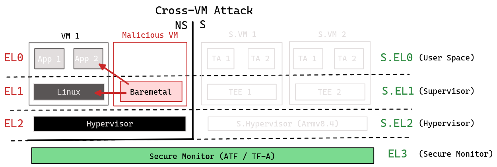
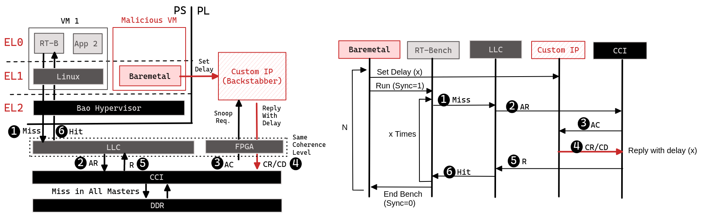
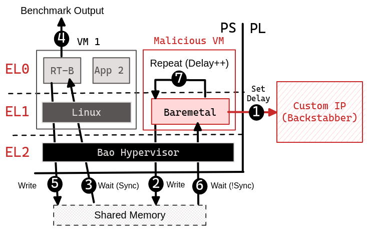

# Devil in FPGA » Permanent Failure 
## Setup
(**Cross-VM Attack**) Bao condifgured with 2 VMs, 1 VM running Linux and other running baremetal code, the malicious code will be deployed on this VM.
- The Malicious VM has control over a custom IP (based on backstabber)
- [RT-bench](https://rt-bench.gitlab.io/rt-bench/index.html) will run on Linux VM 

### To replicate the setup/experiment
- **hardware** -> run `./build_design.sh` and `./save_artifacts.sh`
- **software** 
  * Issue a `nix-build` command
  * Plug the SD_card
  * Run ./result-8
  * Power up the system, stop the u-boot and insert the command:
    *  `fatload mmc 0 0x200000 bao.img; bootm start 0x200000; bootm loados; bootm go`
  * You should see Bao running a dual-guest setup (either dual-baremetal or baremetal+linux). 

## Target Applications 
-  Mser and disparity map algorithms/benchmarks from [RT-bench](https://rt-bench.gitlab.io/rt-bench/index.html) 
-  Isolbench from [RT-bench](https://rt-bench.gitlab.io/rt-bench/index.html) 

## Things to measure and why
- **(Mser and disparity)** Total time to run the algorithms/benchmarks. It should increase, with the increase of the delay to a CCI snoop request. 
- **(Mser and disparity)** Number of LCC misses. It should stay the same, regardless of the size of the delay. We are not increasing the number of misses, but the time each one takes to "fetch" data. 
- **(Isolbench)** Measure the quality of the system isolation/partitioning, i.e., measuring interference and contention on the shared resources. 

## Permanetn Failure Flow 

## Experiment Design 

## Evaluation / Results

## Observations / Conclusions